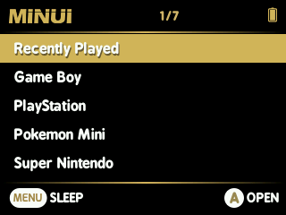

# MinUI

_Fork of [MinUI](https://github.com/shauninman/MinUI) with a Black & White theme._

 

DISCLAIMER: I won't add any features nor fix issues, I don't know any C development.
I'll release a new version every time the official MinUI gets updated.

# Compile

Get the [TrimUI toolchain](https://github.com/shauninman/union-trimui-toolchain) and install it with docker executing `make shell`.

Clone this repo into the `workspace` folder:

`git clone --recurse-submodules https://github.com/axiel7/MinUI-BW.git`

I had to modify the toolchain path from `/opt/trimui-toolchain/bin/` to `/opt/trimui-toolchain/usr/bin/` to make it work.
As I needed to modify some submodules, you can download the changed files [here](), just merge the MinUI folders.

Create a folder `release`.

Now you can compile with `make`.

If you get some error with `zip` just execute `apt update && apt install zip`.
